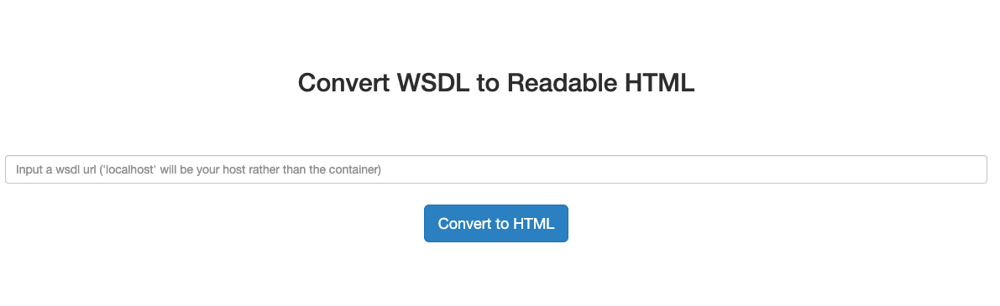

# wsdl2html

Converts WSDLs to html documents which are readable by everybody. 
 

## Example: 


Check the full html [here](https://rawgit.com/chenjianjx/wsdl2html/master/doc/sample/BbsWebService_v2.html). 


# How to run

## Run as a local webapp (inside docker)

* Copy [docker-compose.yml](./docker-compose.yml) to your local disk
* Run it
```bash
docker-compose up
```
* Go to http://localhost:7180

You will see 

## Run as a command line tool

Note:  minimum jdk (not just jre) version: 1.8

Clone or download the code

```bash
cd wsdl2html
mvn clean package 
unzip target/wsdl2html*jarset.zip -d /path/to/your/dir
cd /path/to/your/dir/wsdl2html*
./wsdl2html.sh http://.../some?wsdl /path/to/your/html/directory  
# or wsdl2html.bat for windows

```


## Run it inside your application

* Go to https://search.maven.org/search?q=a:wsdl2html to find the latest version
* Add it as maven/gradle dependency 
* Call the library: 

```java
String html = org.jaxws.wsdl2html.service.Wsdl2Html.generateHtml(wsdlUrl); 
```  
